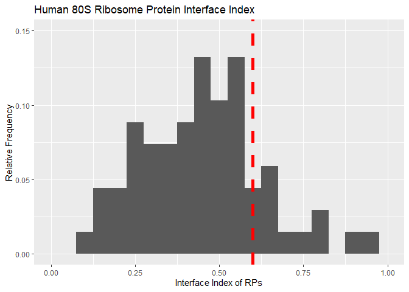
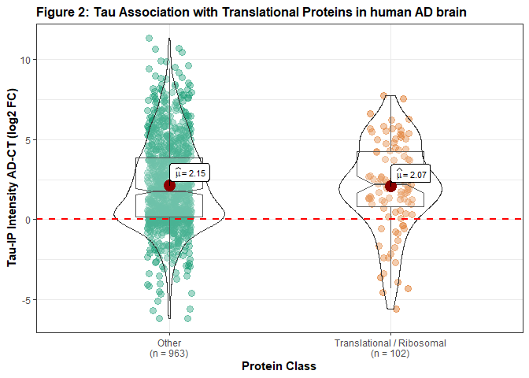
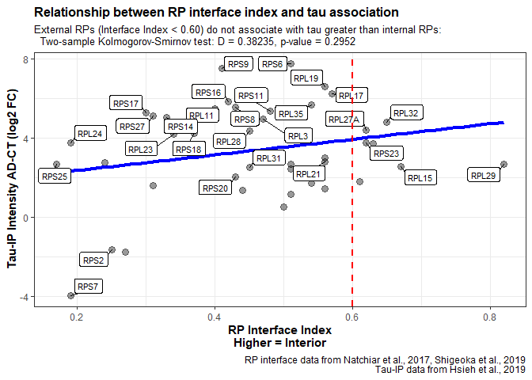

Relationship between ribosomal protein position and tau association in
Alzheimer’s disease
================
Shon Koren

This is code demonstrating the relationship between human ribosomal
protein (RP) structural position and association with the microtubule
associated protein tau. RP structurual position is based on an
“Interface Index” algorithm based on the number of amino acids (AA)
interfacing with either rRNA or water (Natchiar et al., 2017, Shigeoka
et al., 2019).  

\(InterfaceIndex = \displaystyle \frac{{\sum AA}_{rRNA}}{\sum(AA_{rRNA}+AA_{water})}\)

Internal RP proteins have more AA interfacing with rRNA than water
resulting in a higher Interface Index. A common cutoff for RP structural
position is 0.60 (Shigeoka et al., 2019).

  Plotting for the relative frequency of RP interface indices reveals
most RPs are external rather than internal, as expected.  

Next, load the data from Hsieh et al., 2019 which used label free
quantification mass spectrometry (LFQ MS) to investigate the tau
interactome when immunoprecipitated from human postmortem brain tissue.
In this study, tissue samples from the brain of patients with
Alzheimer’s disease (AD) were compared to control, non-demented
patients (n = 4 per group). Before data loading, I filtered out
interface index data from any RPs not detected by MS, limiting data to
roughly 50 out of 80 potential RPs.

As noted by the Hsieh et al., 2019 study among many others including
from the Abisambra lab, tau basally associates with RPs. When we plot
the data from Hsieh 2019, we see that translational or ribosomal
proteins are highly enriched (log2 FC \> 2) in AD over control samples,
suggesting that tau has enhanced association with RPs in AD.

There are two main possibilities dictating tau-RP association ignoring
the association of tau to rRNA or other RNA: 1. Tau binds to
extra-ribosomal proteins more than RPs in stable ribosomes, or 2. Tau
binds to RPs incorporated in ribosomes

If (1) is true, then tau would likely not favor any internal or external
RP. If (2) is true, tau would likely favor associating with external RPs
and prevent association with more internal RPs.

To assess whether there is a tendency for tau to bind to RPs based on
their structural position, the two sample Kolmogorov-Smirnov (two-sample
K-S) test can be used to determine whether two distributions are
independent of one another. Since a common cutoff for internal RPs is an
Interface Index of 0.60, we can separate RPs based on that statistic.
The two-sample K-S test can then be used to test whether the tau
association of RPs is independent of their structural position in the
ribosome:

    ## 
    ##  Two-sample Kolmogorov-Smirnov test
    ## 
    ## data:  rp.filt.in$CTmean and rp.filt.ex$CTmean
    ## D = 0.38235, p-value = 0.2952
    ## alternative hypothesis: two-sided

Since the p value of the two-sample K-S test \> 0.05, the two
distributions of ribosomal structural position (external, II \< 0.60 and
internal, II \> 0.60) are not independent, suggesting tau associates
with RPs regardless of their position in ribosomes. This is more easily
interpreted when plotted:

This analysis reveals that tau associates with RPs regardless of their
structural position. This suggests that (1) is true, tau associates with
RPs prior to their incorporation into the full ribosome. However, other
factors such as RP-rRNA binding or tau’s role in nucleolar activity,
rDNA transcription, and ribosome biogenesis can also factor into tau-RP
binding.

Considering that tau associates with RPs more in AD, we can investigate
whether tau associates with RPs more in AD as a product of their
structural position given what is known about tau’s mislocalization and
ribosome dysfunction in disease. We can repeat our statistical analysis
comparing the distribution of external (\<0.60 II) or internal (\>0.60
II) RPs associating with tau in AD (AD-CT FoldChange):

    ## 
    ##  Two-sample Kolmogorov-Smirnov test
    ## 
    ## data:  rp.filt.in$CTmean and rp.filt.ex$CTmean
    ## D = 0.38235, p-value = 0.2952
    ## alternative hypothesis: two-sided

However, in doing so we reveal that the enhanced association of tau with
RPs also does not correlate with structural position in the ribosome.
This supports tau binding to RPs while not incorporated into the full
ribosomes.

References: 1. Hsieh, Y.-C. et al. Tau-Mediated Disruption of the
Spliceosome Triggers Cryptic RNA Splicing and Neurodegeneration in
Alzheimer’s Disease. Cell Rep 29, 301-316.e10 (2019). 2. Natchiar, S.
K., Myasnikov, A. G., Kratzat, H., Hazemann, I. & Klaholz, B. P.
Visualization of chemical modifications in the human 80S ribosome
structure. Nature 551, 472–477 (2017). 3. Shigeoka, T. et al. On-Site
Ribosome Remodeling by Locally Synthesized Ribosomal Proteins in Axons.
Cell Rep 29, 3605-3619.e10 (2019).
