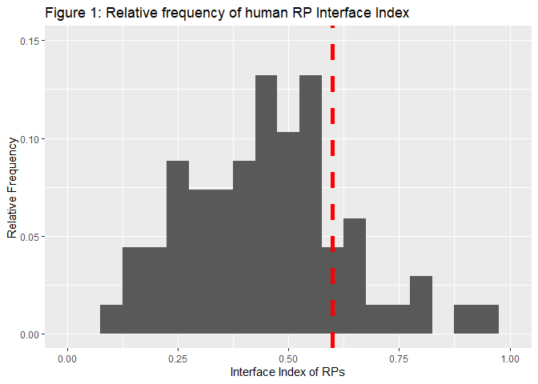
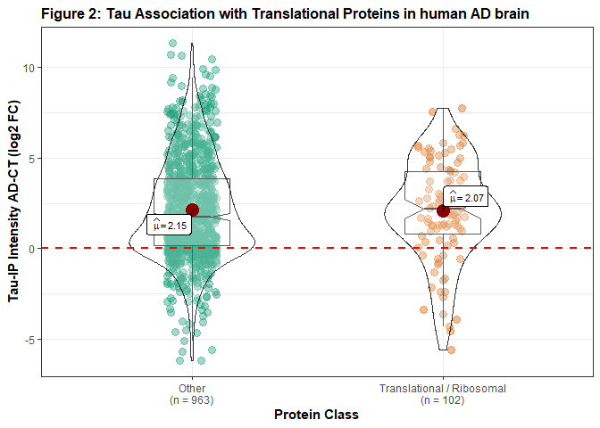
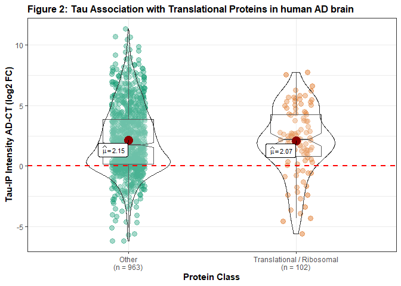

Relationship between ribosomal protein position and tau association in
Alzheimer’s disease
================
Shon A. Koren
August 10th, 2020

## Introduction

This is code demonstrates the relationship between human ribosomal
protein (RP) structural position within the ribosome and association
with the microtubule associated protein (MAP) tau. Despite its canonical
role as a MAP, recent studies have illustrated the role of tau in
(dys)regulating RNA metabolism and protein synthesis (Koren et al.,
2020). To assess properties of RPs associated with tau, we can use the
“Interface Index” algorithm based on the number of amino acids (AA)
interfacing with either rRNA or water for each RP (Natchiar et al.,
2017, Shigeoka et al., 2019).

  
}")  
We can therefore couple this index with quantitiative measurements of
RP-tau association from mass spectrometry (MS) studies of the tau
interactome in human brain.

## Most RPs are external, but a defined core of internal RPs exist.

Internal RP proteins have more AA interfacing with rRNA than water
resulting in a higher Interface Index. A common cutoff for RP structural
position is 0.60 (Shigeoka et al., 2019). Plotting for the relative
frequency of RP interface indices (**Fig. 1**) reveals most RPs are
external rather than internal, but roughly 30% of RPs reside internally.

## Tau interactome data from human brain shows high RP association

The most robust investigation of the tau interactome from human brain in
AD was recently published (Hsieh et al., 2019). This study used label
free quantification mass spectrometry (LFQ MS) to investigate the tau
interactome when immunoprecipitated from human postmortem brain tissue.
Similar to other earlier studies, Hsieh et al noted that tau associates
with many RP and translational proteins and this association is enhanced
in AD (**Fig. 2**). However, not all RPs (of roughly 80) were found due
to limitations in MS depth, limiting analysis to roughly half (41) of
all RPs.

<!-- -->

## RP structural position and association with tau in control, non-demented brain samples are not related

There are two main possibilities dictating tau-RP association ignoring
the association of tau to rRNA or other RNA: 1. Tau binds to
extra-ribosomal proteins more than RPs in stable ribosomes, or 2. Tau
binds to RPs incorporated within ribosomes

If **(1)** is true, then tau would likely not favor any internal or
external RP. If **(2)** is true, tau would likely favor association with
external RPs over more internal RPs.

To assess whether there is a tendency for tau to bind to RPs based on
their structural position, the two sample Kolmogorov-Smirnov (two-sample
K-S) test can be used to determine whether two distributions are
independent of one another. Since a common cutoff for internal RPs is an
Interface Index of 0.60, we can separate RPs based on that statistic.
The two-sample K-S test can then be used to test whether the tau
association of RPs is independent of their structural position in the
ribosome:

    ## 
    ##  Two-sample Kolmogorov-Smirnov test
    ## 
    ## data:  rp.filt.in$CTmean and rp.filt.ex$CTmean
    ## D = 0.38235, p-value = 0.2952
    ## alternative hypothesis: two-sided

Since the *p* value of the two-sample K-S test \> 0.05, the two
distributions of ribosomal structural position (external,  and internal, ) are not independent, suggesting tau associates with RPs
regardless of their position in ribosomes. This is more easily
interpreted when plotted in (**Fig. 3**):

As tau associates with RPs regardless of their structural position,
**(2)** is likely false, tau does not associate more with external RPs
over internal ones. Instead, tau associates with RPs seemingly
regardless of their structural position within the ribosome.

## RP structural position and tau association in AD is also unrelated, despite significantly higher tau-RP association

Considering that tau associates with RPs more in AD, we can investigate
whether tau associates with RPs more in AD as a product of their
structural position given what is known about tau’s mislocalization and
ribosome dysfunction in disease. We can repeat our statistical analysis
comparing the distribution of external ()
or internal ()
RPs associating with tau in AD over in control brain samples (**Fig.
4**):

    ## 
    ##  Two-sample Kolmogorov-Smirnov test
    ## 
    ## data:  rp.filt.in$CTmean and rp.filt.ex$CTmean
    ## D = 0.38235, p-value = 0.2952
    ## alternative hypothesis: two-sided

However, similar to in control samples, the increase in tau-RP
association in AD does not depend on structural position in the
ribosome.  

## References:

1.  Hsieh, Y.-C. et al. Tau-Mediated Disruption of the Spliceosome
    Triggers Cryptic RNA Splicing and Neurodegeneration in Alzheimer’s
    Disease. Cell Rep 29, 301-316.e10 (2019).  
2.  Koren, S. A., Galvis-Escobar, S. & Abisambra, J. F. Tau-mediated
    dysregulation of RNA: Evidence for a common molecular mechanism of
    toxicity in frontotemporal dementia and other tauopathies.
    Neurobiol. Dis. 141, 104939 (2020).  
3.  Natchiar, S. K., Myasnikov, A. G., Kratzat, H., Hazemann, I. &
    Klaholz, B. P. Visualization of chemical modifications in the human
    80S ribosome structure. Nature 551, 472–477 (2017).  
4.  Shigeoka, T. et al. On-Site Ribosome Remodeling by Locally
    Synthesized Ribosomal Proteins in Axons. Cell Rep 29, 3605-3619.e10
    (2019).
